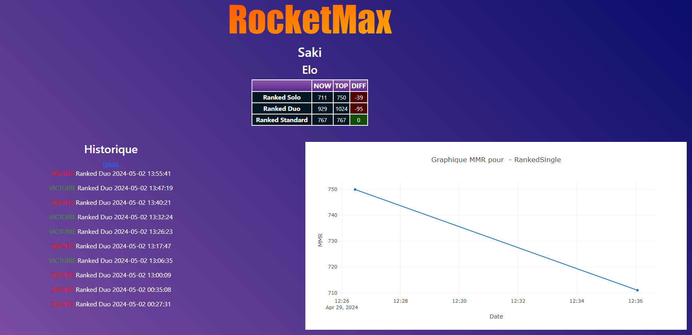

# RocketMax  
FrontEnd et BackEnd d'un [Plugin Rocket League](https://github.com/tellebma/StatsMaximePlugin) qui externalise l'historique de RocketLeague et plus a venir   

## Links
Plugin: [github@tellebma/StatsMaximePlugin](https://github.com/tellebma/StatsMaximePlugin)  
Already exposed: [rocketmax.tellebma.fr](https://rocketmax.tellebma.fr/)  

### Main page



## Docker Image  
Run this docker
[tellebma/backend-bakkesmod](https://hub.docker.com/repository/docker/tellebma/backend-bakkesmod/general)

### Commande run  
```
docker run -d -p 8080:5000 tellebma/backend-bakkesmod:latest
```


# Help  
Si vous le souhaitez vous pouvez nous aider à avancer dans ce projet :) 